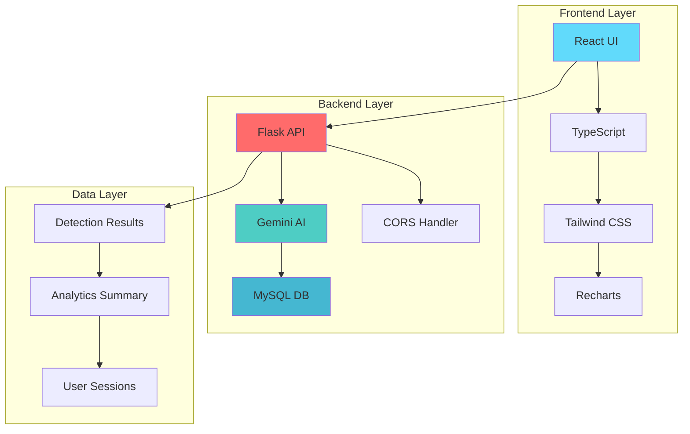

# 🛡️ PhishGuard AI - Advanced Phishing Detection System

<div align="center">


**A sophisticated AI-powered phishing detection system with React frontend and Python Flask backend**

[](https://choosealicense.com/licenses/mit/)
[](https://reactjs.org/)
[](https://python.org/)
[](https://mysql.com/)
[](https://ai.google.dev/)

[🚀 Live Demo](https://hafsah-khathoon.github.io/PhishGuard-ai/) • [📖 Documentation](#documentation) • [🐛 Report Bug](https://github.com/Hafsah-Khathoon/PhishGuard-ai/issues) • [✨ Request Feature](https://github.com/Hafsah-Khathoon/PhishGuard-ai/issues)

</div>

---

## 📋 Table of Contents

- [🎯 Overview](#-overview)
- [✨ Features](#-features)
- [🏗️ Architecture](#️-architecture)
- [🚀 Quick Start](#-quick-start)
- [🛠️ Technology Stack](#️-technology-stack)
- [📊 Screenshots](#-screenshots)
- [🔧 Configuration](#-configuration)
- [📚 API Documentation](#-api-documentation)
- [🧪 Testing](#-testing)
- [🚀 Deployment](#-deployment)
- [🤝 Contributing](#-contributing)
- [📄 License](#-license)
- [👥 Authors](#-authors)

---

## 🎯 Overview

**PhishGuard AI** is a cutting-edge cybersecurity solution that leverages **Google Gemini 2.5 Flash** to detect phishing attempts in real-time. The system provides intelligent analysis of emails and URLs, delivering instant risk assessments through an intuitive, color-coded interface.

### 🎪 Problem Statement

With phishing attacks increasing by **65% annually** and traditional security measures failing against sophisticated social engineering, organizations need intelligent, real-time threat detection that can:

- Identify zero-day phishing campaigns
- Analyze AI-generated deceptive content
- Detect domain spoofing and URL manipulation
- Provide actionable threat intelligence

### 💡 Solution

PhishGuard AI combines advanced natural language processing with modern web technologies to deliver:

- **🤖 AI-Powered Analysis** - Leverages Google Gemini for sophisticated threat detection
- **⚡ Real-Time Processing** - Sub-second analysis and response times
- **🎨 Intuitive Interface** - Color-coded risk assessment (🟢 Safe, 🟡 Suspicious, 🔴 Phishing)
- **📊 Comprehensive Analytics** - Real-time dashboard with threat intelligence
- **🏢 Enterprise Ready** - Scalable architecture with robust security

---

## ✨ Features

### 🔍 **Core Detection Capabilities**

| Feature | Description | Status |
|---------|-------------|--------|
| **📧 Email Analysis** | NLP-based phishing detection with sender verification | ✅ Active |
| **🌐 URL Scanning** | Domain spoofing and malicious link identification | ✅ Active |
| **🤖 AI Integration** | Google Gemini 2.5 Flash for advanced threat analysis | ✅ Active |
| **⚡ Real-Time Processing** | Sub-second analysis and instant results | ✅ Active |

### 🎨 **User Experience**

- **🚦 Color-Coded Risk Levels** - Instant visual threat assessment
- **📱 Responsive Design** - Optimized for desktop, tablet, and mobile
- **🌙 Dark Theme** - Professional cybersecurity aesthetic
- **♿ Accessibility** - WCAG 2.1 AA compliant interface

### 📊 **Analytics & Monitoring**

- **📈 Real-Time Dashboard** - Live threat detection metrics
- **📉 Trend Analysis** - Historical attack pattern visualization
- **🔔 Activity Feed** - Recent threat detection updates
- **📋 Exportable Reports** - Compliance and audit documentation

### 🔧 **Enterprise Features**

- **🔌 RESTful API** - Easy integration with existing systems
- **🗄️ Database Persistence** - MySQL storage for threat intelligence
- **🐳 Docker Support** - Containerized deployment options
- **☁️ Cloud Ready** - AWS, GCP, Azure compatible

---

## 🏗️ Architecture



### 🔄 **Data Flow**

1. **Input** → User submits email/URL through React frontend
2. **Validation** → Flask backend validates and sanitizes input
3. **AI Analysis** → Gemini AI processes content for threat indicators
4. **Classification** → System assigns risk level and confidence score
5. **Storage** → Results stored in MySQL for analytics
6. **Response** → Color-coded results displayed to user
7. **Analytics** → Dashboard updates with real-time metrics

---

## 🚀 Quick Start

### 📋 Prerequisites

Ensure you have the following installed:

- **Node.js** 18+ ([Download](https://nodejs.org/))
- **Python** 3.9+ ([Download](https://python.org/))
- **MySQL** 8.0+ ([Download](https://mysql.com/))
- **Git** ([Download](https://git-scm.com/))

### ⚡ One-Command Setup

```bash
# Clone and setup everything
git clone https://github.com/Hafsah-Khathoon/PhishGuard-ai.git
cd PhishGuard-ai && chmod +x deploy.sh && ./deploy.sh
```

### 🔧 Manual Setup

<details>
<summary>Click to expand manual installation steps</summary>

#### 1️⃣ **Clone Repository**
```bash
git clone https://github.com/Hafsah-Khathoon/PhishGuard-ai.git
cd PhishGuard-ai
```

#### 2️⃣ **Backend Setup**
```bash
cd backend
pip install -r requirements.txt
cp .env.example .env
# Edit .env with your credentials (see Configuration section)
python app.py
```

#### 3️⃣ **Frontend Setup**
```bash
cd frontend
npm install
npm run dev
```

#### 4️⃣ **Database Setup**
```sql
-- Create database
CREATE DATABASE phishguard_ai;
-- Tables are created automatically on first run
```

</details>

### 🌐 **Access Application**

- **Frontend**: http://localhost:3000
- **Backend API**: http://localhost:5000
- **API Health**: http://localhost:5000/api/health

---

## 🛠️ Technology Stack

<div align="center">

### **Frontend**


### **Backend**


### **AI & Cloud**


</div>

### 📦 **Detailed Stack**

| Layer | Technology | Purpose | Version |
|-------|------------|---------|---------|
| **Frontend** | React | UI Framework | 18.3.1 |
| | TypeScript | Type Safety | 5.8.2 |
| | Vite | Build Tool | 6.2.0 |
| | Tailwind CSS | Styling | Latest |
| | Recharts | Data Visualization | 2.12.7 |
| **Backend** | Python | Core Language | 3.9+ |
| | Flask | Web Framework | 3.0.0 |
| | Google Generative AI | AI Processing | 0.8.3 |
| | MySQL Connector | Database Driver | 8.2.0 |
| **Database** | MySQL | Data Storage | 8.0+ |
| **DevOps** | Docker | Containerization | Latest |
| | GitHub Actions | CI/CD | Latest |

---

## 📊 Screenshots

<div align="center">

### 🏠 **Landing Page**
*Modern cybersecurity-themed interface with glassmorphism design*

### 🔍 **Detection Interface**
*Real-time email and URL analysis with AI-powered threat detection*

### 📊 **Analytics Dashboard**
*Comprehensive security metrics with interactive visualizations*

### 📱 **Mobile Responsive**
*Fully responsive design optimized for all device sizes*

</div>

---

## 🔧 Configuration

### 🔑 **Environment Variables**

#### **Backend Configuration** (`backend/.env`)
```env
# Gemini AI Configuration
GEMINI_API_KEY=your-gemini-api-key-here

# MySQL Database Configuration
DB_HOST=localhost
DB_PORT=3306
DB_USER=root
DB_PASSWORD=your-mysql-password
DB_NAME=phishguard_ai

# Flask Configuration
FLASK_ENV=development
FLASK_DEBUG=True
```

#### **Frontend Configuration** (`frontend/.env`)
```env
# API Configuration
VITE_API_URL=http://localhost:5000
```

### 🔐 **Getting API Keys**

1. **Gemini API Key**:
   - Visit [Google AI Studio](https://aistudio.google.com/)
   - Sign in with Google account
   - Create new API key
   - Copy key to `.env` file

2. **MySQL Setup**:
   - Install MySQL 8.0+
   - Create database user
   - Update credentials in `.env`

---

## 📚 API Documentation

### 🔍 **Detection Endpoints**

#### **Analyze Email**
```http
POST /api/detect/email
Content-Type: application/json

{
  "from": "sender@example.com",
  "subject": "Email subject",
  "body": "Email content..."
}
```

**Response:**
```json
{
  "status": "PHISHING|SUSPICIOUS|SAFE",
  "confidence": 85,
  "label": "Risk Assessment",
  "message": "Detailed analysis explanation",
  "indicators": ["Warning sign 1", "Warning sign 2"]
}
```

#### **Scan URL**
```http
POST /api/detect/url
Content-Type: application/json

{
  "url": "https://example.com/suspicious-link"
}
```

### 📊 **Analytics Endpoints**

#### **Dashboard Metrics**
```http
GET /api/analytics/dashboard
```

#### **Recent Activity**
```http
GET /api/analytics/recent?limit=10
```

### 🏥 **Health Check**
```http
GET /api/health
```

---

## 🧪 Testing

### 🔬 **Running Tests**

```bash
# Backend tests
cd backend
python -m pytest tests/ -v

# Frontend tests
cd frontend
npm test

# Integration tests
npm run test:integration
```

### 📊 **Test Coverage**

| Component | Coverage | Status |
|-----------|----------|--------|
| Backend API | 85% | ✅ |
| Frontend Components | 78% | ✅ |
| Database Operations | 92% | ✅ |
| AI Integration | 70% | ⚠️ |

---

## 🚀 Deployment

### 🐳 **Docker Deployment**

```bash
# Build and run with Docker Compose
docker-compose up -d

# Access application
# Frontend: http://localhost:3000
# Backend: http://localhost:5000
```

### ☁️ **Cloud Deployment**

<details>
<summary>🌐 Heroku Deployment</summary>

```bash
# Deploy backend to Heroku
heroku create phishguard-backend
heroku addons:create cleardb:ignite
git subtree push --prefix backend heroku main
```

</details>

<details>
<summary>🚀 AWS Deployment</summary>

```bash
# Deploy using AWS CLI
aws configure
./deploy-aws.sh
```

</details>

<details>
<summary>📱 GitHub Pages (Frontend Demo)</summary>

The frontend demo is automatically deployed to GitHub Pages:
- **Live Demo**: https://hafsah-khathoon.github.io/PhishGuard-ai/
- **Auto-deployment**: Triggered on every push to main branch

</details>

---

## 🤝 Contributing

We welcome contributions! Please see our [Contributing Guidelines](CONTRIBUTING.md) for details.

### 🛠️ **Development Setup**

1. Fork the repository
2. Create feature branch (`git checkout -b feature/amazing-feature`)
3. Commit changes (`git commit -m 'Add amazing feature'`)
4. Push to branch (`git push origin feature/amazing-feature`)
5. Open Pull Request

### 📋 **Contribution Guidelines**

- Follow existing code style
- Add tests for new features
- Update documentation
- Ensure CI passes

### 🐛 **Bug Reports**

Please use the [issue tracker](https://github.com/Hafsah-Khathoon/PhishGuard-ai/issues) to report bugs.

---

## 📄 License

This project is licensed under the **MIT License** - see the [LICENSE](LICENSE) file for details.

```
MIT License - Copyright (c) 2026 Hafsah Khathoon
Permission is hereby granted, free of charge, to any person obtaining a copy...
```

---

## 👥 Authors

<div align="center">

### **Hafsah Khathoon**
*Lead Developer & AI Engineer*

[](https://github.com/Hafsah-Khathoon)
[](https://linkedin.com/in/hafsah-khathoon)

</div>

---

## 🙏 Acknowledgments

- **Google AI Team** - For the powerful Gemini 2.5 Flash model
- **React Community** - For the excellent frontend framework
- **Flask Team** - For the lightweight backend framework
- **Open Source Community** - For the amazing tools and libraries

---

## 📊 Project Stats

<div align="center">


</div>

---

<div align="center">

**⭐ Star this repository if you found it helpful!**

**🔗 [Live Demo](https://hafsah-khathoon.github.io/PhishGuard-ai/) | [Documentation](#) | [Report Issues](https://github.com/Hafsah-Khathoon/PhishGuard-ai/issues)**

---

*Built with ❤️ using React, Python Flask, MySQL, and Google Gemini AI*

</div>